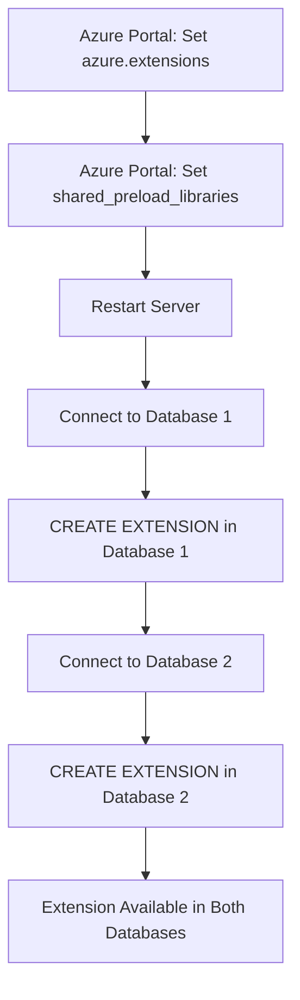

# 🔗 PostgreSQL Database Connection & Extension Management Guide

> **Professional DBA Reference**: Complete guide for understanding PostgreSQL database connections, extension management, and proper setup procedures on Azure Flexible Server

---

## 📋 **Executive Summary**

This guide explains the critical distinction between **server-level** and **database-level** configurations in PostgreSQL, specifically focusing on:
- Database connection strategies and best practices
- Extension management across multiple databases
- Proper setup procedures for monitoring extensions like `pg_stat_statements`
- Common pitfalls and troubleshooting approaches

---

## 🏗️ **PostgreSQL Architecture Overview**

### **Server vs Database Hierarchy**

```
Azure PostgreSQL Flexible Server (myserver.postgres.database.azure.com)
├── 🔧 Server-Level Configuration
│   ├── azure.extensions = "pg_stat_statements,pg_cron,pg_partman"
│   ├── shared_preload_libraries = "pg_stat_statements"
│   └── Other server parameters (memory, connections, etc.)
│
├── 📊 Database: postgres (default system database)
│   ├── Extensions: pg_stat_statements, pg_cron
│   ├── Tables, Views, Functions
│   └── Database-specific data
│
├── 📊 Database: myapp (application database)
│   ├── Extensions: pg_stat_statements, uuid-ossp
│   ├── Application tables and data
│   └── Business logic objects
│
├── 📊 Database: analytics (reporting database)
│   ├── Extensions: pg_stat_statements, pg_partman
│   ├── Analytical tables and views
│   └── Reporting objects
│
└── 📊 Database: test_db (development database)
    ├── Extensions: pg_stat_statements
    ├── Test data and schemas
    └── Development objects
```

---

## 🔑 **Key Concepts**

### **Server-Level vs Database-Level**

| **Aspect** | **Server-Level** | **Database-Level** |
|------------|------------------|-------------------|
| **Configuration** | Azure Portal Server Parameters | SQL commands per database |
| **Scope** | Affects entire server | Affects specific database only |
| **Examples** | `azure.extensions`, `shared_preload_libraries` | `CREATE EXTENSION`, tables, views |
| **Restart Required** | Yes (for some parameters) | No (for extensions) |
| **Visibility** | Same across all databases | Unique per database |

### **Extension Lifecycle**



---

## 🔧 **Connection Methods and Best Practices**

### **Method 1: Direct Database Connection**

```bash
# Connect directly to specific database
psql "host=myserver.postgres.database.azure.com user=myuser dbname=postgres sslmode=require"
psql "host=myserver.postgres.database.azure.com user=myuser dbname=myapp sslmode=require"
psql "host=myserver.postgres.database.azure.com user=myuser dbname=analytics sslmode=require"

# Using environment variables for security
export PGHOST="myserver.postgres.database.azure.com"
export PGUSER="myuser"
export PGSSLMODE="require"

psql -d postgres
psql -d myapp
psql -d analytics
```

### **Method 2: Database Switching Within Session**

```sql
-- Connect to default database first
psql "host=myserver.postgres.database.azure.com user=myuser sslmode=require"

-- Switch between databases
\c postgres     -- Switch to postgres database
\c myapp        -- Switch to myapp database
\c analytics    -- Switch to analytics database
\c test_db      -- Switch to test_db database

-- Verify current database
SELECT current_database();
```

### **Method 3: Azure Portal Query Editor**

```
Azure Portal Navigation:
├── PostgreSQL Flexible Server
├── Query Editor
├── Database Selection Dropdown
│   ├── postgres
│   ├── myapp
│   ├── analytics
│   └── test_db
└── Execute queries in selected database
```

### **Method 4: Connection Pooling with Database Specification**

```python
# Python example with psycopg2
import psycopg2

# Connection pool for different databases
connections = {
    'postgres': psycopg2.connect(
        host="myserver.postgres.database.azure.com",
        database="postgres",
        user="myuser",
        password="password",
        sslmode="require"
    ),
    'myapp': psycopg2.connect(
        host="myserver.postgres.database.azure.com", 
        database="myapp",
        user="myuser",
        password="password",
        sslmode="require"
    )
}
```

---

## 📊 **Extension Management Procedures**

### **Complete pg_stat_statements Setup Process**

#### **Phase 1: Server-Level Configuration (One-Time Setup)**

```bash
# Step 1: Configure azure.extensions
az postgres flexible-server parameter set \
  --resource-group myResourceGroup \
  --server-name myserver \
  --name azure.extensions \
  --value "pg_stat_statements,pg_cron,pg_partman"

# Step 2: Configure shared_preload_libraries
az postgres flexible-server parameter set \
  --resource-group myResourceGroup \
  --server-name myserver \
  --name shared_preload_libraries \
  --value "pg_stat_statements"

# Step 3: Restart server (CRITICAL)
az postgres flexible-server restart \
  --resource-group myResourceGroup \
  --name myserver
```

#### **Phase 2: Database-Level Extension Creation (Per Database)**

```sql
-- Database 1: postgres (system database)
\c postgres
SELECT current_database();  -- Verify: postgres
CREATE EXTENSION IF NOT EXISTS pg_stat_statements;
SELECT * FROM pg_extension WHERE extname = 'pg_stat_statements';

-- Database 2: myapp (application database)
\c myapp
SELECT current_database();  -- Verify: myapp
CREATE EXTENSION IF NOT EXISTS pg_stat_statements;
SELECT * FROM pg_extension WHERE extname = 'pg_stat_statements';

-- Database 3: analytics (reporting database)
\c analytics
SELECT current_database();  -- Verify: analytics
CREATE EXTENSION IF NOT EXISTS pg_stat_statements;
SELECT * FROM pg_extension WHERE extname = 'pg_stat_statements';
```

#### **Phase 3: Verification and Testing**

```sql
-- Test in each database
\c postgres
SELECT COUNT(*) as postgres_queries FROM pg_stat_statements;

\c myapp
SELECT COUNT(*) as myapp_queries FROM pg_stat_statements;

\c analytics
SELECT COUNT(*) as analytics_queries FROM pg_stat_statements;
```

---

## 🔍 **Monitoring and Verification Procedures**

### **Server-Level Verification**

```sql
-- These commands return the same results regardless of current database
SHOW azure.extensions;                    -- Should include pg_stat_statements
SHOW shared_preload_libraries;           -- Should include pg_stat_statements
SELECT version();                        -- PostgreSQL version
SELECT pg_postmaster_start_time();       -- Server restart time
```

### **Database-Level Verification**

```sql
-- Run in each database to check extension status
SELECT 
    current_database() as database_name,
    extname as extension_name,
    extversion as version,
    extrelocatable as relocatable
FROM pg_extension 
WHERE extname = 'pg_stat_statements';

-- Check extension functionality
SELECT 
    current_database() as database_name,
    COUNT(*) as tracked_queries,
    SUM(calls) as total_calls,
    SUM(total_exec_time) as total_execution_time_ms
FROM pg_stat_statements;
```

### **Cross-Database Monitoring Script**

```bash
#!/bin/bash
# comprehensive_db_monitoring.sh
# Monitor pg_stat_statements across all databases

SERVER="myserver.postgres.database.azure.com"
USER="myuser"
DATABASES=("postgres" "myapp" "analytics" "test_db")

echo "=== PostgreSQL Extension Status Report ==="
echo "Server: $SERVER"
echo "Date: $(date)"
echo "User: $USER"
echo

# Check server-level parameters
echo "1. Server-Level Configuration:"
psql "host=$SERVER user=$USER dbname=postgres sslmode=require" -c "
    SELECT 'azure.extensions' as parameter, setting as value FROM pg_settings WHERE name = 'azure.extensions'
    UNION ALL
    SELECT 'shared_preload_libraries' as parameter, setting as value FROM pg_settings WHERE name = 'shared_preload_libraries'
    UNION ALL  
    SELECT 'server_version' as parameter, setting as value FROM pg_settings WHERE name = 'server_version';
"

echo
echo "2. Database-Level Extension Status:"

# Check each database
for db in "${DATABASES[@]}"; do
    echo "--- Database: $db ---"
    
    # Check if database exists and is accessible
    if psql "host=$SERVER user=$USER dbname=$db sslmode=require" -c "SELECT 1;" >/dev/null 2>&1; then
        # Check extension status
        psql "host=$SERVER user=$USER dbname=$db sslmode=require" -c "
            SELECT 
                '$db' as database,
                CASE WHEN EXISTS (SELECT 1 FROM pg_extension WHERE extname = 'pg_stat_statements') 
                     THEN 'INSTALLED' 
                     ELSE 'NOT_INSTALLED' 
                END as pg_stat_statements_status,
                COALESCE((SELECT COUNT(*)::text FROM pg_stat_statements), 'N/A') as tracked_queries;
        "
        
        # Show top 3 queries if extension is available
        psql "host=$SERVER user=$USER dbname=$db sslmode=require" -c "
            SELECT 
                LEFT(query, 60) as query_preview,
                calls,
                ROUND(total_exec_time::numeric, 2) as total_time_ms,
                ROUND(mean_exec_time::numeric, 2) as avg_time_ms
            FROM pg_stat_statements 
            WHERE query NOT LIKE '%pg_stat_statements%'
            ORDER BY total_exec_time DESC 
            LIMIT 3;
        " 2>/dev/null || echo "    pg_stat_statements not available in $db"
        
    else
        echo "    Database $db is not accessible"
    fi
    echo
done

echo "=== End of Report ==="
```

---

## 🚨 **Common Issues and Troubleshooting**

### **Issue 1: Extension Not Found After Server Configuration**

**Symptoms:**
```sql
\c myapp
CREATE EXTENSION pg_stat_statements;
-- ERROR: extension "pg_stat_statements" is not available
```

**Root Cause Analysis:**
```sql
-- Check server parameters
SHOW azure.extensions;           -- Should include pg_stat_statements
SHOW shared_preload_libraries;   -- Should include pg_stat_statements

-- Check available extensions
SELECT * FROM pg_available_extensions WHERE name = 'pg_stat_statements';
```

**Solution:**
1. Verify `azure.extensions` includes `pg_stat_statements`
2. Verify `shared_preload_libraries` includes `pg_stat_statements`
3. Restart server if parameters were recently changed
4. Wait 10-15 minutes after restart for full initialization

### **Issue 2: Extension Works in One Database But Not Another**

**Symptoms:**
```sql
\c postgres
SELECT COUNT(*) FROM pg_stat_statements;  -- Works: returns count

\c myapp  
SELECT COUNT(*) FROM pg_stat_statements;  -- ERROR: relation does not exist
```

**Root Cause:** Extension not created in the target database

**Solution:**
```sql
\c myapp
CREATE EXTENSION IF NOT EXISTS pg_stat_statements;
```

### **Issue 3: Inconsistent Query Statistics**

**Symptoms:**
- Different query counts between databases
- Missing expected queries in statistics

**Root Cause Analysis:**
```sql
-- Check if pg_stat_statements is tracking correctly
\c myapp
SELECT 
    current_database(),
    COUNT(*) as total_queries,
    SUM(calls) as total_calls,
    MAX(last_updated) as last_updated
FROM pg_stat_statements;

-- Check tracking settings
SHOW pg_stat_statements.track;  -- Should be 'all'
SHOW pg_stat_statements.max;    -- Should be adequate (5000+)
```

**Solution:**
1. Verify tracking parameters are correctly set
2. Reset statistics if needed: `SELECT pg_stat_statements_reset();`
3. Generate some test queries and verify tracking

### **Issue 4: Permission Denied Errors**

**Symptoms:**
```sql
CREATE EXTENSION pg_stat_statements;
-- ERROR: permission denied to create extension
```

**Root Cause Analysis:**
```sql
-- Check current user and permissions
SELECT current_user, session_user;
SELECT rolname, rolsuper, rolcreatedb, rolcanlogin 
FROM pg_roles 
WHERE rolname = current_user;
```

**Solution:**
1. Ensure user has `azure_pg_admin` role
2. Connect with proper administrative credentials
3. Verify database ownership permissions

---

## 📋 **Best Practices and Recommendations**

### **1. Standardized Extension Deployment**

```sql
-- Create a deployment script for consistent extension setup
-- deploy_extensions.sql

\echo 'Deploying extensions to all databases...'

\c postgres
\echo 'Database: postgres'
CREATE EXTENSION IF NOT EXISTS pg_stat_statements;
CREATE EXTENSION IF NOT EXISTS pg_buffercache;

\c myapp
\echo 'Database: myapp'
CREATE EXTENSION IF NOT EXISTS pg_stat_statements;
CREATE EXTENSION IF NOT EXISTS "uuid-ossp";

\c analytics
\echo 'Database: analytics'
CREATE EXTENSION IF NOT EXISTS pg_stat_statements;
CREATE EXTENSION IF NOT EXISTS pg_partman;

\echo 'Extension deployment completed.'
```

### **2. Monitoring Database Health**

```sql
-- Create a comprehensive health check view
CREATE OR REPLACE VIEW database_health_summary AS
SELECT 
    current_database() as database_name,
    (SELECT COUNT(*) FROM pg_stat_statements) as tracked_queries,
    (SELECT COUNT(*) FROM pg_extension) as installed_extensions,
    (SELECT COUNT(*) FROM information_schema.tables WHERE table_schema = 'public') as user_tables,
    pg_size_pretty(pg_database_size(current_database())) as database_size,
    (SELECT setting FROM pg_settings WHERE name = 'shared_preload_libraries') as preloaded_libraries;
```

### **3. Automated Extension Management**

```python
#!/usr/bin/env python3
# extension_manager.py
# Automated extension management across databases

import psycopg2
import sys
from typing import List, Dict

class PostgreSQLExtensionManager:
    def __init__(self, host: str, user: str, password: str):
        self.host = host
        self.user = user
        self.password = password
        self.base_connection_params = {
            'host': host,
            'user': user,
            'password': password,
            'sslmode': 'require'
        }
    
    def get_databases(self) -> List[str]:
        """Get list of all databases except system databases"""
        conn = psycopg2.connect(database='postgres', **self.base_connection_params)
        cur = conn.cursor()
        
        cur.execute("""
            SELECT datname FROM pg_database 
            WHERE datistemplate = false 
            AND datname NOT IN ('azure_maintenance', 'azure_sys')
            ORDER BY datname;
        """)
        
        databases = [row[0] for row in cur.fetchall()]
        conn.close()
        return databases
    
    def check_extension_status(self, database: str, extension: str) -> Dict:
        """Check if extension exists in specific database"""
        try:
            conn = psycopg2.connect(database=database, **self.base_connection_params)
            cur = conn.cursor()
            
            cur.execute("""
                SELECT extname, extversion 
                FROM pg_extension 
                WHERE extname = %s;
            """, (extension,))
            
            result = cur.fetchone()
            conn.close()
            
            if result:
                return {'status': 'installed', 'version': result[1]}
            else:
                return {'status': 'not_installed', 'version': None}
                
        except Exception as e:
            return {'status': 'error', 'error': str(e)}
    
    def install_extension(self, database: str, extension: str) -> Dict:
        """Install extension in specific database"""
        try:
            conn = psycopg2.connect(database=database, **self.base_connection_params)
            cur = conn.cursor()
            
            cur.execute(f"CREATE EXTENSION IF NOT EXISTS {extension};")
            conn.commit()
            conn.close()
            
            return {'status': 'success', 'message': f'Extension {extension} installed in {database}'}
            
        except Exception as e:
            return {'status': 'error', 'error': str(e)}
    
    def generate_report(self, extension: str) -> None:
        """Generate extension status report"""
        databases = self.get_databases()
        
        print(f"=== Extension Status Report: {extension} ===")
        print(f"Server: {self.host}")
        print(f"Total Databases: {len(databases)}")
        print()
        
        for db in databases:
            status = self.check_extension_status(db, extension)
            print(f"Database: {db:15} Status: {status['status']:12} Version: {status.get('version', 'N/A')}")
        
        print("\n=== End Report ===")

# Usage example
if __name__ == "__main__":
    manager = PostgreSQLExtensionManager(
        host="myserver.postgres.database.azure.com",
        user="myuser", 
        password="mypassword"
    )
    
    # Generate report
    manager.generate_report("pg_stat_statements")
    
    # Install extension in all databases
    databases = manager.get_databases()
    for db in databases:
        result = manager.install_extension(db, "pg_stat_statements")
        print(f"{db}: {result}")
```

### **4. Connection String Templates**

```bash
# Environment-specific connection templates

# Development
export DEV_PGHOST="dev-server.postgres.database.azure.com"
export DEV_PGUSER="dev_user"
export DEV_PGPASSWORD="dev_password"

# Staging  
export STAGE_PGHOST="stage-server.postgres.database.azure.com"
export STAGE_PGUSER="stage_user"
export STAGE_PGPASSWORD="stage_password"

# Production
export PROD_PGHOST="prod-server.postgres.database.azure.com"
export PROD_PGUSER="prod_user"
export PROD_PGPASSWORD="prod_password"

# Connection functions
connect_dev() {
    psql "host=$DEV_PGHOST user=$DEV_PGUSER dbname=$1 sslmode=require"
}

connect_stage() {
    psql "host=$STAGE_PGHOST user=$STAGE_PGUSER dbname=$1 sslmode=require"
}

connect_prod() {
    psql "host=$PROD_PGHOST user=$PROD_PGUSER dbname=$1 sslmode=require"
}

# Usage: connect_dev myapp
```

---

## 🔗 **Integration with Existing DBA Tools**

### **Query Performance Insight Integration**

```sql
-- Create unified monitoring view across databases
CREATE OR REPLACE FUNCTION get_cross_database_stats()
RETURNS TABLE(
    database_name text,
    query_count bigint,
    total_calls bigint,
    total_time_ms numeric,
    avg_time_ms numeric
) AS $$
DECLARE
    db_record RECORD;
    query_text TEXT;
BEGIN
    -- Get all databases
    FOR db_record IN 
        SELECT datname FROM pg_database 
        WHERE datistemplate = false 
        AND datname NOT LIKE 'azure_%'
    LOOP
        -- Build dynamic query for each database
        query_text := format('
            SELECT %L as database_name,
                   COUNT(*)::bigint as query_count,
                   SUM(calls)::bigint as total_calls,
                   SUM(total_exec_time)::numeric as total_time_ms,
                   AVG(mean_exec_time)::numeric as avg_time_ms
            FROM %I.pg_stat_statements',
            db_record.datname, db_record.datname
        );
        
        -- Execute and return results
        RETURN QUERY EXECUTE query_text;
    END LOOP;
END;
$$ LANGUAGE plpgsql;
```

### **Azure Monitor Integration**

```kusto
// Log Analytics query for cross-database monitoring
AzureDiagnostics
| where Category == "PostgreSQLLogs"
| where Message contains "database:"
| extend DatabaseName = extract(@"database:\s*(\w+)", 1, Message)
| extend QueryDuration = extract(@"duration:\s*([\d.]+)\s*ms", 1, Message)
| where isnotempty(DatabaseName) and isnotempty(QueryDuration)
| summarize 
    QueryCount = count(),
    AvgDuration = avg(todouble(QueryDuration)),
    MaxDuration = max(todouble(QueryDuration))
    by DatabaseName, bin(TimeGenerated, 1h)
| order by TimeGenerated desc
```

---

## 📚 **Reference Documentation**

### **Related DBA Guides**
- [PostgreSQL Azure Server Parameter Setup Guide](./02%20pg_azure_server_parameter_setup_guide.md)
- [PostgreSQL Performance Query Templates](./04%20postgresql_performance_query_templates.md)
- [PostgreSQL Comprehensive Lock Monitoring Guide](./postgresql_comprehensive_lock_monitoring_guide.md)
- [PostgreSQL Comprehensive VACUUM Guide](./postgresql_comprehensive_vacuum_guide.md)

### **Official Documentation**
- [Azure PostgreSQL Flexible Server Extensions](https://docs.microsoft.com/en-us/azure/postgresql/flexible-server/concepts-extensions)
- [PostgreSQL Extension System](https://www.postgresql.org/docs/current/extend-extensions.html)
- [pg_stat_statements Documentation](https://www.postgresql.org/docs/current/pgstatstatements.html)

### **Azure CLI Reference**
- [PostgreSQL Flexible Server Commands](https://docs.microsoft.com/en-us/cli/azure/postgres/flexible-server)
- [Parameter Management](https://docs.microsoft.com/en-us/cli/azure/postgres/flexible-server/parameter)

---

## 🎯 **Quick Reference Checklist**

### **For New Database Setup:**
- [ ] Verify server-level parameters (`azure.extensions`, `shared_preload_libraries`)
- [ ] Restart server if parameters were changed
- [ ] Connect to target database
- [ ] Create required extensions
- [ ] Verify extension functionality
- [ ] Document database-specific configurations

### **For Troubleshooting:**
- [ ] Check current database with `SELECT current_database();`
- [ ] Verify server parameters with `SHOW` commands
- [ ] Check extension availability with `pg_available_extensions`
- [ ] Verify extension installation with `pg_extension`
- [ ] Test extension functionality with sample queries
- [ ] Review Azure Portal Activity Log for errors

### **For Monitoring:**
- [ ] Implement cross-database monitoring scripts
- [ ] Set up automated health checks
- [ ] Configure Azure Monitor integration
- [ ] Establish baseline performance metrics
- [ ] Create alerting for extension failures

---

*This guide provides comprehensive coverage of PostgreSQL database connections and extension management for Azure environments. Regular review and updates ensure continued effectiveness in production database operations.*